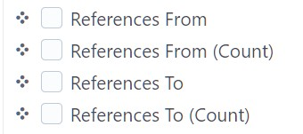
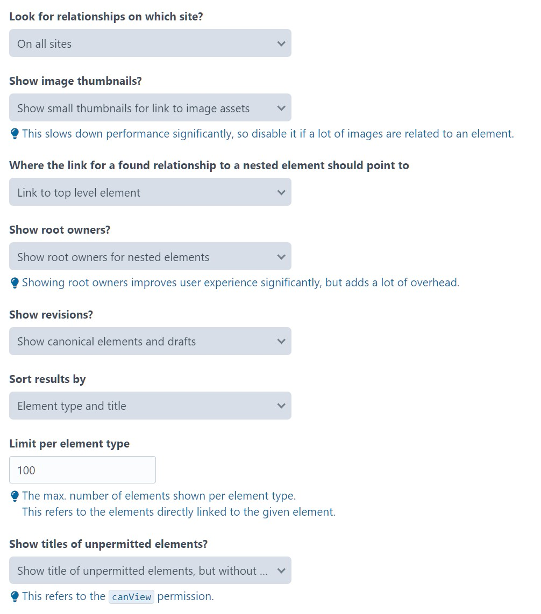

# Element Map 5

Pre-beta version.

__Read me is work in progress!__

Display incoming and outgoing relationships for elements in Craft's Control Panel.

## Requirements

Developed for Craft CMS 5.8 and PHP 8.3.

Should work with Craft CMS 5.4.0 (where `getRootOwner` was introduced) or later, and PHP 8.2 or later, but untested.

## Installation

Update `composer.json` file in your project root so that it includes the following:

```json
{
  "require": {
    "wsydney76/craft-elementmap5": "dev-main"
  },
  "minimum-stability": "dev",
  "prefer-stable": true,
  "repositories": [
    {
      "type": "vcs",
      "url": "https://github.com/wsydney76/craft-elementmap5"
    }
  ]
}
```

Run `composer update` to install the plugin.

Then, install the plugin via the Craft CMS Control Panel, or run `craft plugin/install _elementmap`.

## History/Motivation

This started years as an enhanced fork of the abandoned Element Map plugin for Craft CMS 3, was kept alive for Craft 4/5,
then became part of the [Extras bundle](https://github.com/wsydney76/extras). That was a bit over the top, so it was split out again into its own plugin.

Partially refactored, with some enhancements (and probably some new bugs).

What we wanted to achieve and could not find in other plugins back then (or now):

* Show relations on demand in a popup instead of in the sidebar, so that page load performance is not affected.
* Tries to be as comprehensive as possible.
* Shows more infos like element/product type, (colored) icons, image thumbnails, matrix field name etc. for a better author experience.
* Include relationships for drafts (include draft creator), and (optionally) revisions.
* For nested elements, also show the root owner, so that you can see where the element is actually used.
* Supports major Craft CMS plugins like Commerce, Campaign, Neo.
* Allows to be extended for custom element types via events.
* Support display of relationships in the index view of elements, so that you can see relationships at a glance.
* Provide settings/events to control performance for large sites with many elements and relationships, like omitting certain element types, additional info or limiting the number of elements shown.


## Screenshots

### Element Edit Page

<div style="max-width:500px">


Display icons, colors, nested entry types, link to main element or nested entry. Display image thumbnails.


Also display drafts, with draft creator.

</div>

### Element Index




### Settings Page



## Notes

This is currently only used/tested in limited use cases.

In complex multi-site, multi-user, Commerce settings or deeply nested content models, there is a good chance it works as expected, but maybe not.

Also, it can only detect relationships in the `relations` database table, so it won't work for links created by reference tags, in CKEditor inline links.

Plugins that create their own custom relationships are not supported (like Verbb Navigation).

Handles relationships for

* Craft CMS Elements
  * Entries 
  * Categories
  * Assets
  * Users
  * Global Sets
  * Content Blocks
  * Addresses

Does not handle relationships for tags.

* Supported plugins
  * Commerce (Products/Variants) 
  * Campaign (Email Campaigns)
  * Neo (Blocks)

## Caveats

* Uses undocumented Craft CMS javascript APIs, so it may break anytime.
* For elements that don't support drafts (like Assets, Variants), the plugin does not detect relationships from unsaved changes.
* The use in element indexes is not performance optimized, so it may not work well with large sites with many elements and relationships.
* Performance relevant setting are not yet granular enough.

## API

Get HTML fragment or JSON data for an element.

User must be logged in.

### HTML:

```twig
'{{ cpUrl("elementmap-getrelations/#{element.site.id}/#{element.id}") }}'
```

Example: `https://test-extras.ddev.site/admin/elementmap-getrelations/1/6843`

### JSON:

Add `?json=1` to the URL to get a JSON response.

Return format:

```json
{
  "map": {
    "incoming": [
      {
        "id": 6790,
        "icon": "@appicons/bullseye-arrow.svg",
        "color": "var(--black)",
        "title": "Test Category -> Internal link",
        "url": "https://test-extras.ddev.site/admin/categories/testCategories/6782-test-category?site=de",
        "sort": "01",
        "canView": true
      },
      {
        "id": 6842,
        "icon": "@appicons/vial.svg",
        "color": "var(--fuchsia-500)",
        "title": "Test Globals (Test, Provisional Draft, admin)",
        "url": "https://test-extras.ddev.site/admin/entries/test/6778-test-globals?site=de",
        "sort": "01",
        "canView": true
      }
    ],
    "outgoing": [
      {
        "id": 6794,
        "icon": "@appicons/vial.svg",
        "color": "var(--fuchsia-500)",
        "title": "Test Nested Image (Test)",
        "url": "https://test-extras.ddev.site/admin/entries/test/6794-test-nested-image?site=de",
        "sort": "01",
        "canView": true
      }
    ],
    "elementsNotShown": 0
  }
}
```

## Events

Enables integration of other element types via events.

### Add relations from relations table, for element types not supported by the plugin


```php
Event::on(
    ElementmapRenderer::class,
    ElementmapRenderer::EVENT_ADD_MAP_DATA,
    function(ElementmapAddMapDataEvent $event) {

        if ($event->type !== 'wsydney76\\myplugin\\elements\\MyElementType') {
            return;
        }

        // Select relevant elements from ids in the relations table
        $elements = MyElementType::find()
            ->where(['id' => $event->elementIds])
            ->site('*')
            ->unique()
            ->collect();

        // Map the elements to the expected format
        $results = $elements->map(fn(Product $element) => [
            'id' => $element->id,
            'icon' => MyElementType::ICON,
            'title' => $element->title,
            'url' => $element->cpEditUrl,
            'sort' => 95,
            'canView' => $element->canView(Craft::$app->user->identity),
        ]);

        $event->data = $results->toArray();
    }
);
```

### Add elements not in the relations table

```php
use verbb\navigation\elements\Node;

Event::on(
    ElementmapRenderer::class,
    ElementmapRenderer::EVENT_ADD_ELEMENTS,
    function(ElementmapAddEvent $event): void {

        if ($event->direction === 'incoming') {
            $nodes = Node::find()->elementId($event->element->id)->collect();
            $event->data = $nodes->map(
                function($node) {
                    $nav = $node->nav;
                    $parent = $node->parent;
                    return [
                        'id' => $node->id,
                        'icon' => '@verbb/navigation/icon.svg',
                        'title' => $nav->name . ' (Navigation' . ($parent ? ' - ' . $parent->title : '') . ')',
                        'url' => UrlHelper::cpUrl('navigation/navs/build/' . $nav->id),
                        'sort' => 95,
                        'canView' => true,
                    ];
                }
            )->toArray();
        }
    }
);
```

### Omit certain element types from the Element Map

```php
Event::on(
    ElementmapRenderer::class,
    ElementmapRenderer::EVENT_ELEMENTTYPE_CONFIG,
    function(ElementmapTypeConfigEvent $event) {
        unset($event->config['craft\elements\Category']);
    }
);
```

## AI generated documentation

Unchecked, unedited for now, but should already be useful.

[ElementmapController](docs/ElementmapController.md)  
[ElementmapService](docs/ElementmapService.md)  
[ElementmapRenderer](docs/ElementmapRenderer.md)  
[ElementmapSidebarButton](docs/elementmap_sidebarbutton.md)  
[ElementmapContent](docs/elementmap_content.md)

## Status

This is a pre-beta version, so expect bugs, missing features, and incomplete documentation.

This is a private plugin that comes without support, not available on Packagist or the Plugin Store.

Use at your own risk.

## Roadmap

### For final beta release

* Check naming of events, methods, classes, variables for consistency and clarity
* Update inline comments
* Check via PhpStan, ECS
* More comprehensive tests
* Check for accessibility issues
* Check wording
* Improve documentation

### On the long term

* Improve performance for large sites with many elements and relationships
* Add more granular settings to control performance
* Provide a way to show all relationships beyond limits from settings
* Selectively show relationships for certain element types
