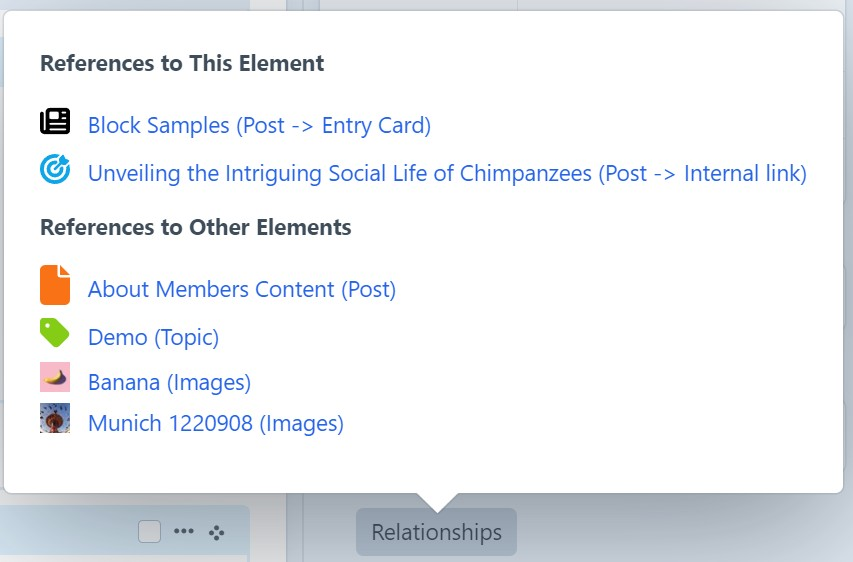
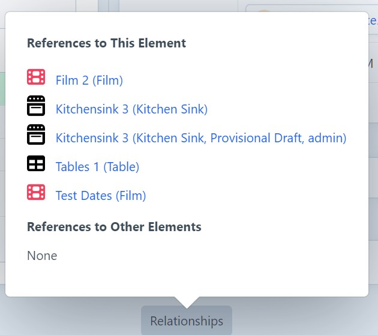
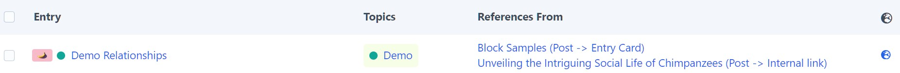

# Element Map 5

__Read me is work in progress!__

Display incoming and outgoing relationships for elements in Craft's Control Panel.

## Requirements

Developed for Craft CMS 5.8 and PHP 8.3.

Should work with Craft CMS 5.4.0 (where `getRootOwner` was introduced) or later, and PHP 8.2 or later, but untested.

## Installation

Add to `composer.json` file in your project root to require this plugin:

```json
{
  "require": {
    "wsydney76/extras": "dev-main"
  },
  "minimum-stability": "dev",
  "prefer-stable": true,
  "repositories": [
    {
      "type": "vcs",
      "url": "https://github.com/wsydney76/craft-elementmap5"
    }
  ]
}
```

## Usage

Forked from the abandoned elementmaps plugin.

Show relationships between elements.

<div style="max-width:500px">



Display icons, colors, nested entry types, link to main element or nested entry. Display image thumbnails.



Also display drafts, with draft creator.

</div>




Note: While this is actually the most used feature, it is currently only used/tested in limited use cases.

In complex multi-site, multi-user, Commerce settings or deeply nested content models, it hopefully works as expected, but maybe not.

Also, it can only detect relationships in the `relations` database table, so it won't work for links created by reference tags, in CKEditor inline links.

Also, plugins that create their own custom relationships are not supported (like Verbb Navigation).

Handles relationships for

* Craft CMS Elements
  * Entries 
  * Categories
  * Assets
  * Users
  * Global Sets
  * Content Blocks
  * Addresses

Does not handle relationships for tags.

* Plugins
  * Commerce (Products/Variants) 
  * Campaign (Email Campaigns)
  * Neo (Blocks)

Enables integration of other element types via events.

## Events

```php
use verbb\navigation\elements\Node;

Event::on(
    ElementmapRenderer::class,
    ElementmapRenderer::EVENT_ADD_ELEMENTS,
    function(ElementmapAddEvent $event): void {

        if ($event->direction === 'incoming') {
            $nodes = Node::find()->elementId($event->element->id)->collect();
            $event->data = $nodes->map(
                function($node) {
                    $nav = $node->nav;
                    $parent = $node->parent;
                    return [
                        'id' => $node->id,
                        'icon' => '@verbb/navigation/icon.svg',
                        'title' => $nav->name . ' (Navigation' . ($parent ? ' - ' . $parent->title : '') . ')',
                        'url' => UrlHelper::cpUrl('navigation/navs/build/' . $nav->id),
                        'sort' => 95,
                        'canView' => true,
                    ];
                }
            )->toArray();
        }
    }
);
```

```php
Event::on(
    ElementmapRenderer::class,
    ElementmapRenderer::EVENT_ELEMENT_TYPE_CONFIG,
    function(ElementTypeConfigEvent $event) {
        unset($event->config['craft\elements\Category']);
    }
);
```

## AI generated documentation

[ElementmapService](docs/ElementmapService.md)
[ElementmapRenderer](docs/ElementmapRenderer.md)
[ElementmapController](docs/ElementmapController.md)
[ElementmapSidebarButton](docs/elementmap_sidebarbutton.md)
[ElementmapContent](docs/elementmap_content.md)

